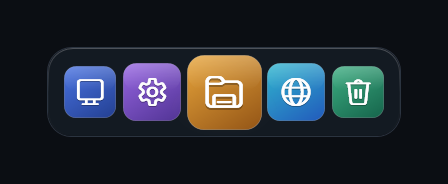

# BudsDock 1.0.1

BudsDock是一款面向Windows 11 x64的桌面快捷启动栏，使用WPF与.NET 10构建。支持应用、快捷方式和文件夹，多显示器定位，深浅主题，以及本地配置备份。

## 运行

从[GitHub Release](https://github.com/Buds-2025/budsdock/releases/latest)下载发行包，解压后运行`BudsDock.exe`。本地打包产物位于`outputs`目录。

| 版本 | 压缩包 | 运行要求 |
| --- | --- | --- |
| Portable完整版 | `BudsDock-1.0.1-win-x64-portable.zip`，约64.10MB | 自带运行时，无需预装.NET |
| Compact小体积版 | `BudsDock-1.0.1-win-x64-compact.zip`，约236KB | 已安装.NET 10 Desktop Runtime x64 |

.NET SDK和Desktop Runtime均可运行Compact；仅安装基础.NET Runtime不包含WPF。下载运行时可访问[微软.NET 10下载页](https://dotnet.microsoft.com/en-us/download/dotnet/10.0)。两个版本功能一致，配置位置相同。完整大小、SHA-256和版本信息见发行包旁的JSON与SHA256文件。MB按1,000,000字节计算。

## 1.0.1的改进

外观增加工作室、简约、经典三套预设，所有参数仍可单独调整。首次运行默认关闭倒影，底板采用细边缘高光。悬停去掉了彩色描边光、双层光晕和底部亮线，改用低饱和、低透明度环境光；淡入约220毫秒，淡出约320毫秒。简约预设关闭动效、倒影与环境光。深色、浅色和跟随Windows主题均可选。

图标可直接在Dock上拖动排序，右键打开、编辑或调整顺序。设置页支持名称与路径搜索，以及文件夹添加与编辑。搜索只过滤设置列表，不改变Dock内容。Ctrl＋F定位搜索框，Ctrl＋1至Ctrl＋4切换设置页，Esc返回或关闭设置。Dock获得焦点后可用方向键切换图标、Enter启动，Ctrl＋逗号打开设置。

可以选择Dock所在显示器，也可通过拖动空白区域跨屏移动。Dock记忆显示器和屏幕内相对位置；显示器断开时回到主屏，重新连接后恢复到已保存显示器。顶部、底部横向排列，左右两侧纵向排列。图标过多或缩放过大时自动缩小以适应工作区。全屏避让只响应Dock所在屏幕上的前台全屏窗口。

外部图标使用两个后台解码槽，图片最长边限制为256像素，图像缓存限制为256项。Shell图标优先请求256像素版本，失败后回退到关联图标。异步加载完成后同时更新Dock、列表和详情预览。设置窗口在首次打开时创建；关闭全屏避让时停止轮询，开启时每1.5秒检查一次。

发布目标调整为`net10.0-windows`，移除未使用的Windows SDK与WinRT投影程序集；Portable仅携带中英文卫星资源。没有对WPF程序集进行不受支持的裁剪，也未加入第三方NuGet包。完整版压缩包比1.0.0发行包减少约15.7％。



## 使用与配置

支持EXE、LNK以及文件夹，可从设置页添加，也可直接拖入Dock。首次运行预置此电脑、控制面板、文件资源管理器、Microsoft Edge、回收站。支持自定义PNG、JPG、JPEG、BMP、GIF、ICO图片；统一使用原始图标，已移除默认外观和单个图标外观选择；旧配置中的底片与单色模式自动恢复为原图，自定义图片路径保留。

可调整图标尺寸、间距、Dock缩放、内边距、圆角、底板透明度、倒影、环境光及悬停倍率。固定位置只禁止移动Dock，不影响图标排序。鼠标穿透可通过系统托盘或Ctrl＋Alt＋D恢复。默认保持置顶、开启全屏避让和开机启动，可在设置中修改。

配置、导入图标和日志保存在`%LocalAppData%\BudsDock`。程序文件可放在任意有执行权限的目录。移动程序后，手动运行一次可刷新开机启动路径。配置实时保存，保存失败时可在页脚重试。

支持导入、导出包含自定义图标的`.budsdock`配置包。导入前保留恢复副本，并保留本机开机启动选择，默认关闭鼠标穿透。兼容已有1.0.0配置；遇到未来配置版本时保留副本并拒绝覆盖。旧配置不会被强制应用新版外观预设。

## 兼容范围

当前发行包支持Windows 11、Intel或AMD x64处理器。只显示一个Dock，可选择其显示器；不支持每屏独立Dock。混合DPI和显示器断连恢复已实现，但仍需在不同显卡、缩放比例和屏幕组合上实机验证。暂不提供原生ARM64版、商店应用枚举、自动隐藏、窗口运行指示器、系统背景模糊、SVG或WebP导入。

应用不访问网络，不包含遥测、账号或在线更新。默认普通用户权限；只有显式启用某个项目的管理员启动才触发UAC。移除图标只修改配置。发行包未进行商业代码签名。

## 开发与验证

要求Windows和.NET 10 SDK，发布目标为Windows 11 x64。

```powershell
dotnet build .\BudsDock.sln -c Release -p:Platform=x64
dotnet run --project .\tests\BudsDock.Tests\BudsDock.Tests.csproj -c Release -p:Platform=x64

dotnet publish .\src\BudsDock\BudsDock.csproj -c Release -p:Platform=x64 -p:PublishProfile=Portable -o .\artifacts\publish\BudsDock-1.0.1-win-x64-portable
dotnet publish .\src\BudsDock\BudsDock.csproj -c Release -p:Platform=x64 -p:PublishProfile=Compact -o .\artifacts\publish\BudsDock-1.0.1-win-x64-compact
python .\scripts\package_release.py --variant portable
python .\scripts\package_release.py --variant compact
.\scripts\verify_release.ps1
```

45项自动化测试覆盖定位、外观参数、配置迁移与恢复、并发保存、目录分类、缓存刷新、图片解码、资源一致性等。发布验证脚本对两种发行包分别执行960×680深色中文与640×480浅色英文检查，并执行真实WPF环境中的搜索隔离、图标排序、300个并发图标加载和缓存上限验证。截图、日志、测试数据均存入项目`artifacts`目录，不自动批量清理。

审查结论、测量口径和验证边界见[升级验收报告](docs/UPGRADE-1.0.1.md)。旧版设计与审查文档可通过Git历史查阅。

## English

BudsDock is a Windows 11 x64 launcher built with WPF and .NET 10. Version 1.0.1 adds appearance presets, restrained ambient lighting, drag reordering, folder shortcuts, independent settings search, selectable displays, asynchronous bounded icon loading and a compact framework-dependent distribution. Portable includes the runtime; Compact requires .NET 10 Desktop Runtime x64.
